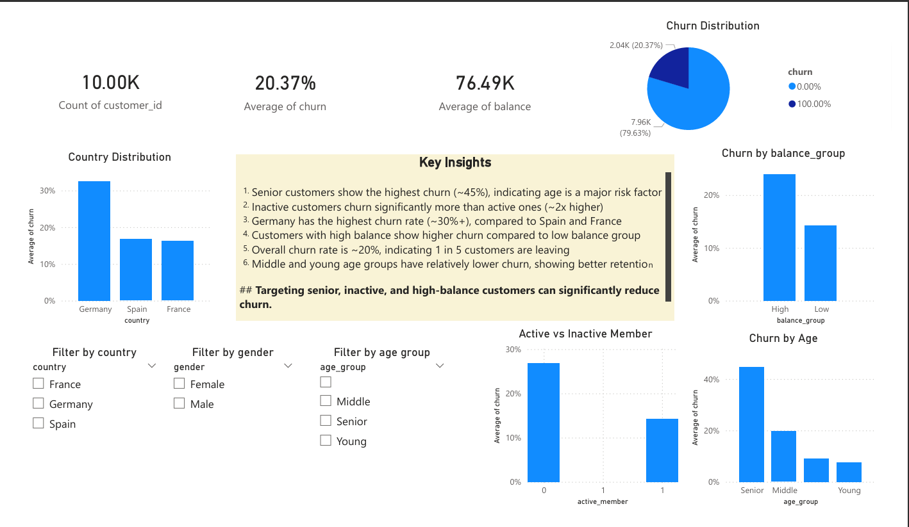

# 🏦 Churn AI - Banking Customer Churn Prediction with Insights

## 📌 Overview

This project is an end-to-end **Banking Customer Churn Prediction System** enhanced with **LLM-powered insights using Groq API**.

It predicts whether a customer will churn (leave the bank) and provides **human-readable explanations** using an LLM.

---

## 🚀 Features

- 🔮 Customer churn prediction using Machine Learning
- 📊 Feature importance analysis
- 🧠 LLM-based explanation (Groq LLM)
- 🌐 Streamlit web app interface
- 📁 Modular code structure

---

## 🧠 Problem Statement

Banks want to identify customers who are likely to leave (churn) so they can take preventive actions.

This system:

1. Takes customer data as input
2. Predicts churn (0 = No, 1 = Yes)
3. Uses Groq LLM to explain *why* the prediction occurred

---

## 🏗️ Project Structure

```
├── Data/
│   ├── bank_churn_prediction.csv
│   ├── clean_bank_churn_prediction.csv
│
├── Notebook/
│   └── churn_AI_EDA_SQL_analysis.ipynb
│
├── model/
│   └── pipeline.pkl
│
├── streamlit_API_app.py   #main app
├── groq_setup.py
├── utils.py
├── requirements.txt
├── README.md
```

---

## ⚙️ Tech Stack

- Python 
- Scikit-learn 
- Pandas & NumPy 
- Streamlit 
- Groq LLM API 

---

## 🧹 Data Cleaning & Preprocessing

Before analysis and modeling, the dataset was cleaned and prepared to ensure quality and consistency.

### Key Steps:

- Handling missing values and inconsistencies
- Encoding categorical variables (Country, Gender)
- Removing/handling outliers
- Feature scaling and transformation
- Creating derived features (e.g., age groups)

---

## 📊 Data Analysis & Visualization

Extensive **Exploratory Data Analysis (EDA)** was performed to understand customer behavior and churn patterns.

### 🔍 Analysis Performed:

- Customer distribution by age, country, and gender
- Churn rate across different segments
- Impact of balance, activity status, and number of products

### 📈 Power BI Dashboard:

An interactive Power BI dashboard was created to visualize key insights.




### 💡 Key Insights:

- Senior customers show the highest churn (\~45%), indicating age is a major risk factor.
- Inactive customers churn significantly more than active ones (\~2x higher)
- Germany has the highest churn rate (\~30%+), compared to Spain and France
- &#x20;Customers with high balance show higher churn compared to low balance group Overall churn rate is \~20%, indicating 1 in 5 customers are leaving
- &#x20;Middle and young age groups have relatively lower churn, showing better retention.
- Targeting senior, inactive, and high-balance customers can significantly reduce churn.

---

## 📊 Machine Learning Pipeline

### 1. Data Preprocessing

- Handling categorical variables (e.g., country, Gender)
- Feature scaling
- Feature engineering (e.g., age groups)

### 2. Model Training

- Algorithm used: Random Forest
- Trained on historical customer data

### 3. Prediction

- Output:
  - `0` → Customer will NOT churn
  - `1` → Customer WILL churn

---

## 🧠 LLM Integration (Groq)

The Groq LLM is used to generate **natural language insights** based on:

- Customer input features
- Model prediction

### Example Prompt

```python
prompt = f"""
You are a banking data analyst.

Customer data:
{data['input']}

Prediction:
0 = Not Churn, 1 = Churn
Model Output: {data['prediction']}

Explain why this customer is likely/unlikely to churn.
"""
```

### Output

- Human-readable explanation
- Business-friendly insights

---

## 🖥️ Streamlit App

The Streamlit app allows users to:

- Input customer details
- Get churn prediction
- View LLM-generated explanation

### Run the App

```bash
streamlit run streamlit_API_app.py
```

---

## 🔑 Groq API Setup

1. Create an account on Groq
2. Get your API key
3. Set environment variable:

```bash
export GROQ_API_KEY="your_api_key_here"
```

For Windows:

```bash
set GROQ_API_KEY=your_api_key_here
```

---

## 📦 Installation

### Step 1: Clone Repository

```bash
git clone <your-repo-url>
cd <repo-name>
```

### Step 2: Create Virtual Environment

```bash
python -m venv .venv
source .venv/bin/activate   # Mac/Linux
.venv\Scripts\activate      # Windows
```

### Step 3: Install Dependencies

```bash
pip install -r requirements.txt
```

---

## 📈 Key Insights (from model)

- Senior customers have highest churn rate
- Inactive users are more likely to churn
- Customers with low balance tend to leave
- Geography impacts churn (e.g., Germany higher)

---

## 🧩 Challenges Faced

- Integrating ML model with LLM
- Prompt engineering for meaningful explanations
- Structuring modular code

---

## 🔮 Future Improvements

- Add SHAP for explainability
- Deploy on cloud (AWS/GCP)
- Add real-time data pipeline
- Improve UI/UX

---

## 🤝 Contribution

Feel free to fork this repo and contribute!

---

## 📜 License

This project is for educational purposes.

---

## 👩‍💻 Author

Pragya Singh

---

⭐ If you like this project, don’t forget to star the repo!

